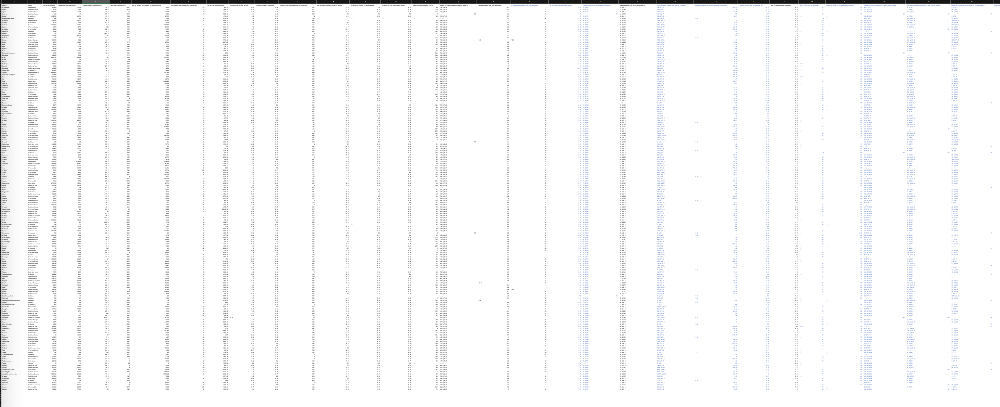

# ETL PROJECT

Group members: Carlos Soda, Nick Carr, Liam Twomey, Robbie Hockley

---
1. [Selection of Datasets](#selection-of-datasets)
2. [Description of Datasets](#description-of-datasets)
3. [Transformation of Datasets](#transformation-of-datasets)
4. [Database Schemata](#database-schemata)

---
## 1. SELECTION OF DATASETS

Sources:  
*  [Country Statistics UNdata](https://www.kaggle.com/datasets/sudalairajkumar/undata-country-profiles)  
* [Height of Male and Female by Country 2022](https://www.kaggle.com/datasets/majyhain/height-of-male-and-female-by-country-2022)  
* [Global status report on noncommunicable diseases 2014](https://www.who.int/publications/i/item/9789241564854)  

Srk (2017) Download (43 kB) Country Statistics UNData | Overview. This dataset contains key statistical indicators covering General Information Economic Indicators Social Indicators Environmental & Infrastructure Indicators. 
www.kaggle.com/datasets/sudalairajkumar/undata-country-profiles

Majyhain (2022) Download (4 kB) Height of Male and Female by Country | Overview This dataset contains tallest to smallest average heights of males and females by country covering rank, country name, male height and female height.
www.kaggle.com/datasets/majyhain/height-of-male-and-female-by-country-2022

WHO (2014). Download (6.7 MB) Global status report on noncommunicable diseases | Overview The report provides data on the current situation, identifying bottlenecks as well as opportunities and priority actions for attaining global targets. 
www.who.int/publications-detail-redirect/9789241564854

[Back to top](#etl-project)

---
## 2. DESCRIPTION OF DATASETS

* `country_profile_variables.csv` - In depth look at categorical factors covering population and infrastructre by country
* `height_of_male_and_female_by_country.csv` - average height of males and females by country.
* `world_bmi.csv` - average BMI of males, females, and both genders by country.

[Back to top](#etl-project)

---
## 3. TRANSFORMATION OF DATASETS

Excel was used to do some basic cleaning of the datasets. This was to remove any columns that were irrelevent to the question that was being investigated.

The image below is the raw dataset from the source. The columns in blue were removed to make the information contained within it relevant

[Back to top](#etl-project)

---
## 4. DATABASE SCHEMATA

[Back to top](#etl-project)

---
